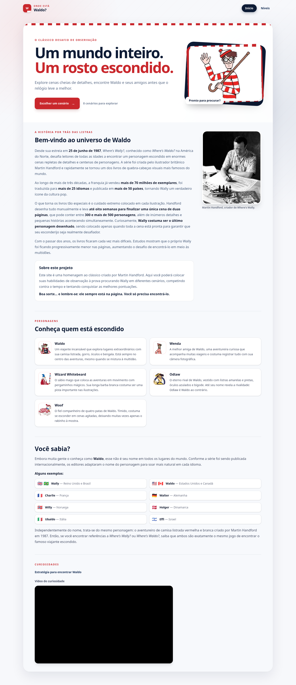
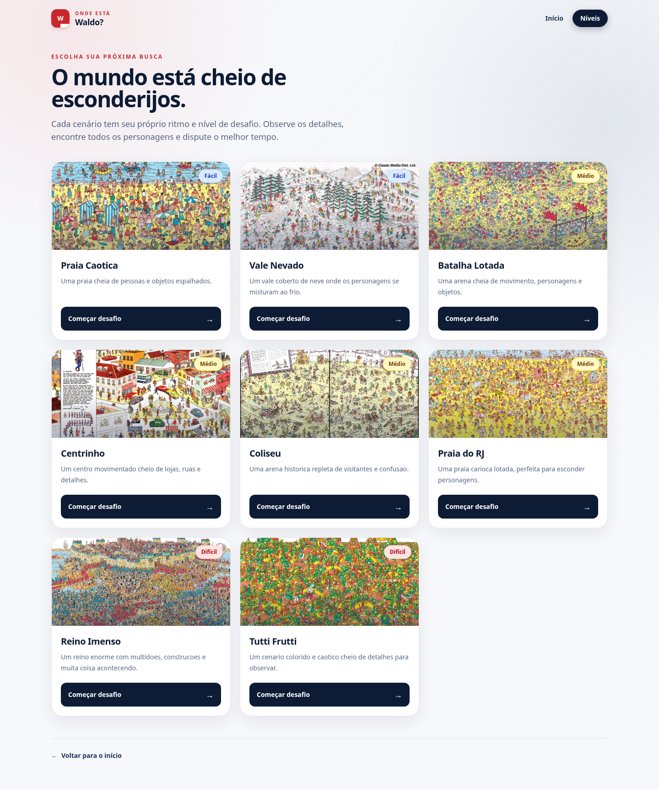
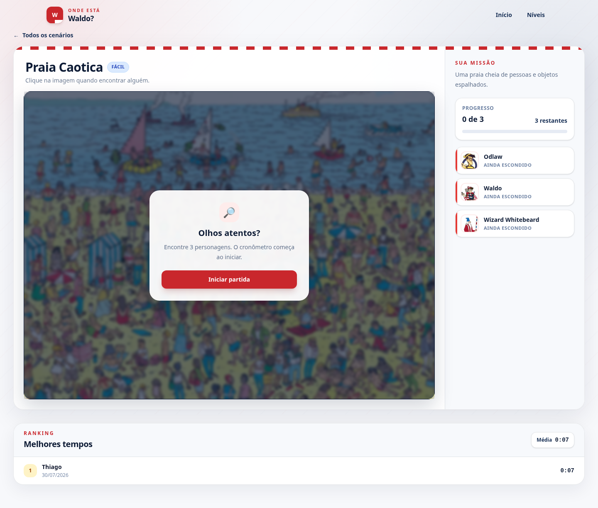

# Where Is Waldo?

Responsive photo-tagging game built with React and TypeScript. Players choose a
map, find its assigned characters, race against a server-timed clock, and
submit completed runs to a per-map leaderboard.

The REST API and database layer are available in the
[backend repository](https://github.com/nadas-t/Back---Where-is-Waldo).

## Table of Contents

- [Screenshots](#screenshots)
- [Features](#features)
- [Tech Stack](#tech-stack)
- [Architecture](#architecture)
- [Getting Started](#getting-started)
- [Environment Variables](#environment-variables)
- [Available Scripts](#available-scripts)
- [Project Structure](#project-structure)
- [Design Decisions](#design-decisions)
- [Future Improvements](#future-improvements)

## Screenshots

### Home



### Level Selection



### Game



## Features

- Home page with game instructions, character introductions, and responsive
  navigation.
- Level gallery loaded from the API, including map descriptions and localized
  difficulty labels.
- Eight included map images and individual portraits for Waldo, Wenda, Wizard
  Whitebeard, and Odlaw.
- Server-backed game sessions that start only after the player begins a level.
- Responsive image targeting that converts browser click positions into
  normalized coordinates before sending a guess to the API.
- Contextual character-selection menu positioned around the chosen point.
- Immediate correct/incorrect guess feedback and a live target roster.
- Live elapsed-time display based on the session's server timestamp.
- Completion dialog for submitting a player name or continuing anonymously.
- Per-map leaderboard with ranked times, dates, and average completion time.
- Loading skeletons, empty states, API error messages, keyboard focus styles,
  and reduced-motion support.
- Client-side routes for the home page, level selection, and individual games.

## Tech Stack

- React 19
- TypeScript
- React Router 7
- Tailwind CSS 4
- Vite 8
- ESLint 10
- Browser Fetch API

## Architecture

The application is a client-rendered single-page application:

- `src/pages/` contains route-level views for the home page, level selection,
  and gameplay.
- `src/components/` contains reusable interface elements such as the site
  header, level cards, character menu, timer, roster, and leaderboard.
- `src/services/api.ts` defines API response types and centralizes all backend
  requests and error parsing.
- `src/utils/time.ts` contains elapsed-time calculation and formatting helpers.
- `src/App.tsx` defines the client-side route table.
- `public/` contains map, character, icon, and home-page image assets.
- `src/index.css` loads Tailwind CSS and defines the project's theme tokens,
  shared surfaces, animations, and accessibility-related global styles.

The frontend does not contain target coordinates used by the current game
flow. It sends the selected character and normalized click coordinates to the
backend, which decides whether a guess is correct.

## Getting Started

### Prerequisites

- Node.js and npm
- A running instance of the
  [Where Is Waldo API](https://github.com/nadas-t/Back---Where-is-Waldo)

### 1. Clone the repository

```bash
git clone https://github.com/nadas-t/Front---Where-is-Waldo.git
cd Front---Where-is-Waldo
```

### 2. Install dependencies

```bash
npm install
```

### 3. Configure the API URL

Create a `.env` file in the project root:

```env
VITE_API_BASE_URL=http://localhost:3000
```

The value must be the backend origin, without an `/api` suffix. The client
removes one trailing slash automatically.

### 4. Configure and run the backend

Follow the backend repository's setup instructions to create the PostgreSQL
database, apply its Prisma migration, seed the maps, and start the API. Its
`CORS_ORIGIN` must allow this frontend's origin. Vite uses
`http://localhost:5173` by default when that port is available.

### 5. Start the frontend

```bash
npm run dev
```

Open the local URL printed by Vite.

## Environment Variables

| Variable | Required | Description |
| --- | --- | --- |
| `VITE_API_BASE_URL` | No | Backend origin used for API requests. Defaults to `http://localhost:3000`. |

Example:

```env
VITE_API_BASE_URL=https://api.example.com
```

Vite exposes variables prefixed with `VITE_` to browser code. Do not place
secrets in this file. Environment files are ignored by Git.

## Available Scripts

| Script | Description |
| --- | --- |
| `npm run dev` | Starts the Vite development server with hot module replacement. |
| `npm run build` | Type-checks the project with TypeScript project references and creates a production bundle in `dist/`. |
| `npm run lint` | Runs ESLint across the project. |
| `npm run preview` | Serves the production bundle locally for previewing. Run `npm run build` first. |

## Project Structure

```text
Front---Where-is-Waldo/
├── public/
│   ├── characters/
│   ├── home/
│   ├── icons/
│   └── maps/
├── src/
│   ├── components/
│   │   ├── CharacterMenu.tsx
│   │   ├── CharacterRoster.tsx
│   │   ├── LeaderBoard.tsx
│   │   ├── LevelCard.tsx
│   │   ├── SiteHeader.tsx
│   │   └── Timer.tsx
│   ├── pages/
│   │   ├── Game.tsx
│   │   ├── Home.tsx
│   │   └── Levels.tsx
│   ├── services/
│   │   └── api.ts
│   ├── utils/
│   │   └── time.ts
│   ├── App.tsx
│   ├── index.css
│   └── main.tsx
├── eslint.config.js
├── index.html
├── vite.config.ts
└── package.json
```

## Design Decisions

- **Backend-validated guesses:** the browser submits coordinates but does not
  receive the correct target positions from the API.
- **Normalized click coordinates:** guesses remain accurate when the map image
  is resized for different screen sizes.
- **Server-timed sessions:** the displayed timer is derived from the backend's
  `startedAt` and `completedAt` values rather than a client-submitted score.
- **Central API module:** request construction, response types, defaults, and
  API error extraction stay in one service.
- **Route-level state:** each game view owns its session, progress, feedback,
  score submission, and leaderboard-refresh state; no global state library is
  required for the current scope.
- **Static assets at root-relative paths:** database-provided image paths map
  directly to files served from `public/`.

## Future Improvements

- Add component, API-service, and end-to-end tests for the complete game flow.
- Add dedicated screenshots and a short gameplay recording to the documentation.
- Remove the unused legacy mock-data module after confirming it is no longer
  needed.
- Persist an active session across accidental page refreshes.
- Add retry controls for failed map and leaderboard requests.
- Add client-side player-name constraints matching backend validation.
- Add deployment configuration and document the published frontend and API URLs.
